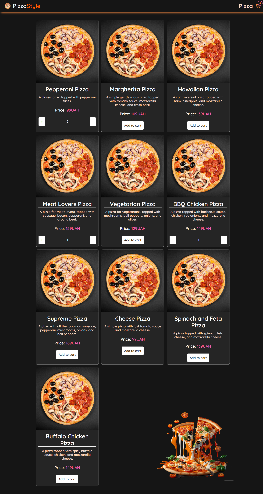
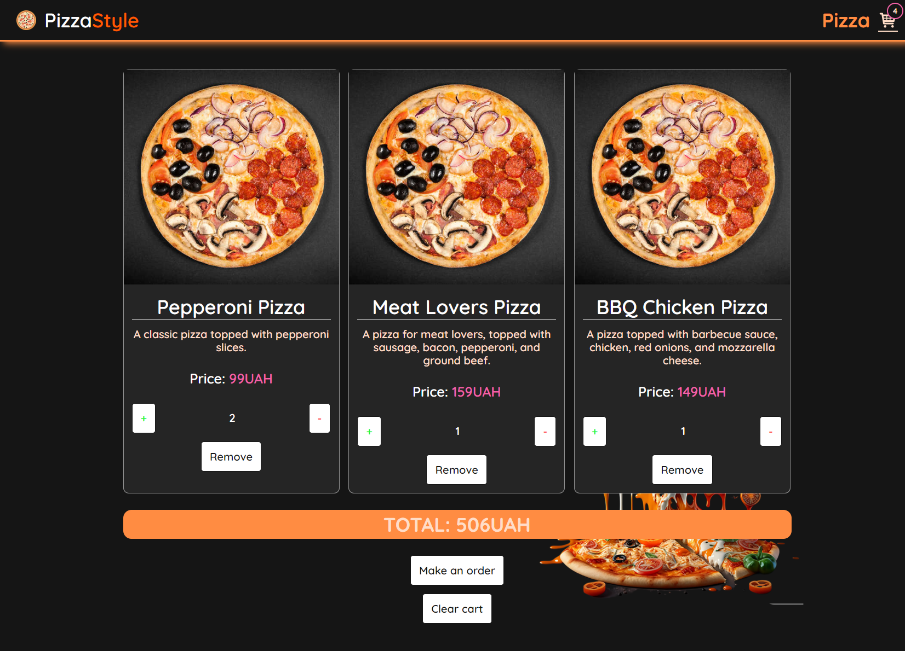

## Web application for ordering pizza.

## A live version is available via the link in the About section.

### Application Description:

Applications for ordering pizza from the possible options. Application with adaptive design for sizes 320px, 768px 1280px.

### Pizza page



### Cart page



### Application functionality:

- On the main page, the user sees a list of pizzas, with the original Add to cart button.
- When the user clicks on the Add to cart button:

1. Pizza is added to the cart, the corresponding number appears in the header next to the icon.
2. Instead of the Add to cart button, 2 Plus and Minus buttons appear, as well as the amount of the selected pizza.
3. When changing the number of pizzas, the basket in the header instantly displays the total number of selected pizzas.
4. If the user, by pressing the Minus button, returns the amount of pizza to 0, the pizza will be removed from the basket, and the card will return to its original state.

- On the Cart page, the user sees the selected pizzas. There is also additional functionality:

1. Each pizza has a Remove button that removes the pizza from the cart.
2. Under the cards is the total amount of pizzas.
3. There are also 2 new buttons under the cards:

- Make an order when you click on which the basket is cleared and a notification appears with a successful order
  pizza.
- Clear cart to empty the cart followed by a notification.

### Additional information:

- The project uses a local file as a database, the object of one pizza is represented as follows:

```
{
     id: 1
     title: "Pepperoni Pizza",
     description: "A classic pizza topped with pepperoni slices.",
     price: 99
     image:
       "https://panda-pizza.com.ua/cache/dish-mobile/img/dishes/pizza/4seasons.jpg?130223",
   }
```

### Technologies used:

- Typescript
- React
- React Router
- Redux Toolkit, Redux persist

### Installation and setup:

- To run this project locally, follow these steps:

- Clone the repository to your local machine.
- Open the project in the code editor.
- Install project dependencies with the npm install command.
- Run the project with the npm start command.
- Open the project in a web browser at http://localhost:3000.
